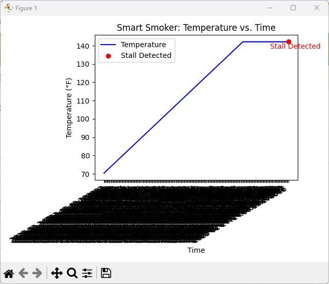

# buzzline-04-case

We can analyze and visualize different types of streaming data as the information arrives.

The producers don't change from buzzline-03-case - they write the same information to a Kafka topic, except the csv producer for the smart smoker has been modified to not run continuously. It will stop after reading all the rows in the CSV file. 
The consumers have been enhanced to add visualization. 

This project uses matplotlib and its animation capabilities for visualization. 

It generates three applications:

1. A basic producer and consumer that exchange information via a dynamically updated file. 
2. A JSON producer and consumer that exchange information via a Kafka topic. 
3. A CSV producer and consumer that exchange information via a different Kafka topic. 

All three applications produce live charts to illustrate the data. 

## Task 1. Use Tools from Module 1 and 2

Before starting, ensure you have completed the setup tasks in <https://github.com/denisecase/buzzline-01-case> and <https://github.com/denisecase/buzzline-02-case> first. 
Python 3.11 is required. 

## Task 2. Copy This Example Project and Rename

Once the tools are installed, copy/fork this project into your GitHub account
and create your own version of this project to run and experiment with. 
Follow the instructions in [FORK-THIS-REPO.md](https://github.com/denisecase/buzzline-01-case/docs/FORK-THIS-REPO.md).

OR: For more practice, add these example scripts or features to your earlier project. 
You'll want to check requirements.txt, .env, and the consumers, producers, and util folders. 
Use your README.md to record your workflow and commands. 
    

## Task 3. Manage Local Project Virtual Environment

Follow the instructions in [MANAGE-VENV.md](https://github.com/denisecase/buzzline-01-case/docs/MANAGE-VENV.md) to:
1. Create your .venv
2. Activate .venv
3. Install the required dependencies using requirements.txt.

## Task 4. Start Zookeeper and Kafka (2 Terminals)

If Zookeeper and Kafka are not already running, you'll need to restart them.
See instructions at [SETUP-KAFKA.md] to:

1. Start Zookeeper Service ([link](https://github.com/denisecase/buzzline-02-case/blob/main/docs/SETUP-KAFKA.md#step-7-start-zookeeper-service-terminal-1))
2. Start Kafka ([link](https://github.com/denisecase/buzzline-02-case/blob/main/docs/SETUP-KAFKA.md#step-8-start-kafka-terminal-2))

---

## Task 5. Start a Basic (File-based, not Kafka) Streaming Application

This will take two terminals:

1. One to run the producer which writes to a file in the data folder. 
2. Another to run the consumer which reads from the dynamically updated file. 

### Producer Terminal

Start the producer to generate the messages. 

In VS Code, open a NEW terminal.
Use the commands below to activate .venv, and start the producer. 

Windows:

```shell
.venv\Scripts\activate
py -m producers.basic_json_producer_case
```

Mac/Linux:
```zsh
source .venv/bin/activate
python3 -m producers.basic_json_producer_case
```

### Consumer Terminal

Start the associated consumer that will process and visualize the messages. 

In VS Code, open a NEW terminal in your root project folder. 
Use the commands below to activate .venv, and start the consumer. 

Windows:
```shell
.venv\Scripts\activate
py -m consumers.basic_json_consumer_case
```

Mac/Linux:
```zsh
source .venv/bin/activate
python3 -m consumers.basic_json_consumer_case
```

### Review the Application Code

Review the code for both the producer and the consumer. 
Understand how the information is generated, written to a file, and read and processed. 
Review the visualization code to see how the live chart is produced. 
When done, remember to kill the associated terminals for the producer and consumer. 


---

## Task 6. Start a (Kafka-based) JSON Streaming Application

This will take two terminals:

1. One to run the producer which writes to a Kafka topic. 
2. Another to run the consumer which reads from that Kafka topic.

For each one, you will need to: 
1. Open a new terminal. 
2. Activate your .venv.
3. Know the command that works on your machine to execute python (e.g. py or python3).
4. Know how to use the -m (module flag to run your file as a module).
5. Know the full name of the module you want to run. 
   - Look in the producers folder for json_producer_case.
   - Look in the consumers folder for json_consumer_case.


### Review the Application Code

Review the code for both the producer and the consumer. 
Understand how the information is generated and written to a Kafka topic, and consumed from the topic and processed. 
Review the visualization code to see how the live chart is produced. 

Compare the non-Kafka JSON streaming application to the Kafka JSON streaming application.
By organizing code into reusable functions, which functions can be reused? 
Which functions must be updated based on the sharing mechanism? 
What new functions/features must be added to work with a Kafka-based streaming system?

When done, remember to kill the associated terminals for the producer and consumer. 

---

## Task 7. Start a (Kafka-based) CSV Streaming Application

This will take two terminals:

1. One to run the producer which writes to a Kafka topic. 
2. Another to run the consumer which reads from that Kafka topic.

For each one, you will need to: 
1. Open a new terminal. 
2. Activate your .venv.
3. Know the command that works on your machine to execute python (e.g. py or python3).
4. Know how to use the -m (module flag to run your file as a module).
5. Know the full name of the module you want to run. 
   - Look in the producers folder for csv_producer_case.
   - Look in the consumers folder for csv_consumer_case.

### Review the Application Code

Review the code for both the producer and the consumer. 
Understand how the information is generated and written to a Kafka topic, and consumed from the topic and processed. 
Review the visualization code to see how the live chart is produced. 

Compare the JSON application to the CSV streaming application.
By organizing code into reusable functions, which functions can be reused? 
Which functions must be updated based on the type of data?
How does the visualization code get changed based on the type of data and type of chart used?
Which aspects are similar between the different types of data? 

When done, remember to kill the associated terminals for the producer and consumer. 

---

## Possible Explorations

- JSON: Process messages in batches of 5 messages.
- JSON:Limit the display to the top 3 authors.
- Modify chart appearance.
- Stream a different set of data and visualize the custom stream with an appropriate chart. 
- How do we find out what types of charts are available? 
- How do we find out what attributes and colors are available?

---

## Later Work Sessions
When resuming work on this project:
1. Open the folder in VS Code. 
2. Start the Zookeeper service.
3. Start the Kafka service.
4. Activate your local project virtual environment (.env).

## Save Space
To save disk space, you can delete the .venv folder when not actively working on this project.
You can always recreate it, activate it, and reinstall the necessary packages later. 
Managing Python virtual environments is a valuable skill. 

## License
This project is licensed under the MIT License as an example project. 
You are encouraged to fork, copy, explore, and modify the code as you like. 
See the [LICENSE](LICENSE.txt) file for more.

## Live Chart Examples

Live Bar Chart (JSON file streaming)


Live Bar Chart (Kafka JSON streaming)


Live Line Chart with Alert (Kafka CSV streaming)



